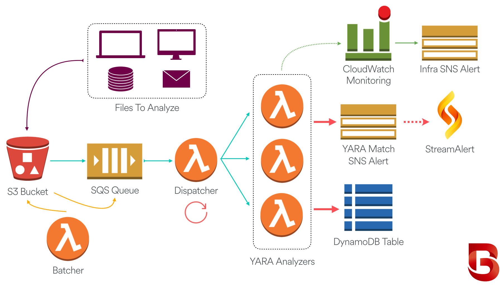

# BinaryAlert: Serverless, Real-time & Retroactive Malware Detection
[](https://travis-ci.org/airbnb/binaryalert)
[](https://coveralls.io/github/airbnb/binaryalert?branch=master)


BinaryAlert is an open-source serverless AWS pipeline where any file uploaded to an S3 bucket is
immediately scanned with a configurable set of [YARA](https://virustotal.github.io/yara/) rules.
An alert will fire as soon as any match is found, giving an incident response team the ability to
quickly contain the threat before it spreads.


## Features
  * **Built with Amazon Web Services (AWS):** An AWS account is all you need to deploy BinaryAlert.
  * **Broad YARA Support:** Add your own YARA rules and/or automatically clone them from third-party
  repos. [`PE`](http://yara.readthedocs.io/en/latest/modules/pe.html),
  [`math`](http://yara.readthedocs.io/en/latest/modules/math.html), and
   [`hash`](http://yara.readthedocs.io/en/latest/modules/hash.html) YARA modules are supported.
  * **Real-Time:** Files uploaded to BinaryAlert (S3 bucket) are immediately queued for analysis.
  * **Serverless:** All computation is handled by [Lambda](https://aws.amazon.com/lambda/)
  functions. No servers to manage means stronger security and automatic scaling!
  * **Infrastructure-as-Code:** The entire infrastructure is described with
  [Terraform](https://www.terraform.io) configuration files, enabling anyone to deploy BinaryAlert
  in a matter of minutes with a single command.
  * **Retroactive Analysis:** After updating the YARA ruleset, BinaryAlert will retroactively scan
  the entire file corpus to find any new matches.
  * **Easily Configurable:** BinaryAlert configuration is managed in a single Terraform variables
  file.
  * **Quality Code:** Written in Python3 with unit tests and linting to ensure a clean and reliable
  codebase.
  * **Low Cost:** The AWS bill is based only on how many files are analyzed.


## Quick Start
  1. Install dependencies
      1. Install Python3.6, pip3, [virtualenv](https://virtualenv.pypa.io/en/stable/), and
      [Terraform v0.10.1+](https://www.terraform.io/downloads.html).
      2. Create a virtual environment: `virtualenv -p python3 venv`
      3. Activate the virtual env: `source venv/bin/activate`
      4. Install third-party libraries: `pip3 install -r requirements.txt`
          1. If the installation encounters problems finding
          `openssl.h`, try `export CFLAGS='-I/usr/local/opt/openssl/include'` before the install.
  2. Configure settings
      1. Set your AWS credentials using any
      [method supported by Terraform](https://www.terraform.io/docs/providers/aws/#authentication).
      The two simplest options are to run `aws configure` (saves `~/.aws/credentials` file) or
      ```bash
      export AWS_DEFAULT_REGION="region-name"
      export AWS_ACCESS_KEY_ID="access-key"
      export AWS_SECRET_ACCESS_KEY="secret-key"
      ```
      2. Fill out the base configuration options in [`terraform.tfvars`](terraform/terraform.tfvars)
  3. Deploy: `python3 manage.py deploy`
  4. In order to receive YARA match alerts, you must manually subscribe to the generated SNS topics.
     Go to the [SNS console](https://console.aws.amazon.com/sns/v2/home) and
     [add a subscription](http://docs.aws.amazon.com/sns/latest/dg/SubscribeTopic.html) to the
     `*_binaryalert_yara_match_alerts` topic (which receives YARA match alerts) and the
     `*_binaryalert_metric_alarms` topic (which receives CloudWatch alerts if the service is down).
     SNS supports a variety of subscription endpoints, including email and SMS. SNS subscriptions
     must be confirmed by the destination, which is why this step can't be automated by Terraform.

That's it! Now any file you upload to the BinaryAlert S3 bucket will automatically trigger YARA
analysis and you can rest easier knowing that your files are safe.


## CLI Tool: `manage.py`
For simplicity, BinaryAlert management commands are bundled together in [`manage.py`](manage.py).

Usage: `python3 manage.py [--help] [command]`


## YARA Rules
YARA rules are stored in the [rules/](rules) folder. See [rules/README.md](rules/README.md) for more
information about adding and updating YARA rules.


## Architecture
  

  1. The organization collects files and delivers them to their BinaryAlert S3 bucket.
  Files of interest could include executable binaries, email attachments, documents, etc.
  2. Every file uploaded to the S3 bucket is immediately queued for analysis.
  3. A dispatching Lambda function runs every minute, grouping files into batches and invoking up to
  dozens of analyzers in parallel.
  4. Each analyzer scans its files using a list of pre-compiled YARA rules.
  5. YARA matches are saved to DynamoDB and an alert is sent to an SNS topic. We use StreamAlert to
  dispatch these alerts, but other organizations can instead consume the alerts via email or any
  other supported SNS subscription.
  6. For retroactive analysis, a batching Lambda function enqueues the entire S3 bucket to be
  re-analyzed.
  7. Configurable CloudWatch alarms will trigger if any BinaryAlert component is behaving
  abnormally. This will notify a different SNS topic than the one used for YARA match alerts.


## Updating Pip Packages
The exact `pip3` package versions used are frozen in
[`requirements.txt`](requirements.txt). However, to make upgrading packages easier,
[`requirements_top_level.txt`](requirements_top_level.txt) contains only the top-level packages
required by BinaryAlert. To upgrade the package requirements,

```bash
pip3 install -r requirements_top_level.txt --upgrade
pip3 freeze > requirements.txt
```


## Directory Overview
  * [`lambda_functions`](lambda_functions): Source code for each BinaryAlert Lambda function.
  * [`rules`](rules): Collection of public and private YARA rules.
  * [`terraform`](terraform): AWS infrastructure represented as Terraform configuration files.
  * [`tests`](tests): Unit tests amd mocks.

## Links
* [Announcement Post](https://medium.com/airbnb-engineering/binaryalert-real-time-serverless-malware-detection-ca44370c1b90)
* [Twitter](https://twitter.com/binaryalert_io) (unofficial)
* [Slack](https://binaryalert.herokuapp.com/) (unofficial)
