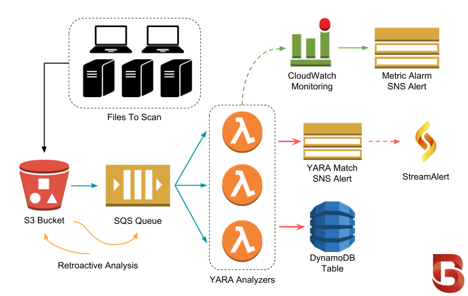

Architecture
============
BinaryAlert utilizes a `serverless <https://aws.amazon.com/serverless/>`_ architecture which is low-cost and easy to scale and maintain. While it's helpful to understand how BinaryAlert works, keep in mind that Terraform manages all of these components so you don't have to!

Analysis Lifecycle
------------------

1. The organization collects files and `delivers them <uploading-files.html>`_ to their BinaryAlert S3 bucket. Files of interest could include executable binaries, email attachments, documents, etc.
2. Every file uploaded to the S3 bucket is immediately queued for analysis (using `S3 event notifications <http://docs.aws.amazon.com/AmazonS3/latest/dev/NotificationHowTo.html>`_).
3. The SQS queue automatically batches files and invokes many analyzers in parallel.
4. Each analyzer scans its files using a list of pre-compiled `YARA rules <adding-yara-rules.html>`_.
5. `YARA matches <yara-matches.html>`_ are saved to DynamoDB and an alert is sent to an SNS topic. You can subscribe to these alerts via `StreamAlert <https://streamalert.io>`_, email, or any other supported `SNS subscription <http://docs.aws.amazon.com/sns/latest/api/API_Subscribe.html>`_.
6. For :ref:`retroactive analysis <retro_scan>`, the CLI will enqueue the entire S3 bucket to be re-analyzed.
7. Configurable :ref:`CloudWatch alarms <metric_alarms>` will trigger if any BinaryAlert component is behaving abnormally. This will notify a different SNS topic than the one used for YARA match alerts.
